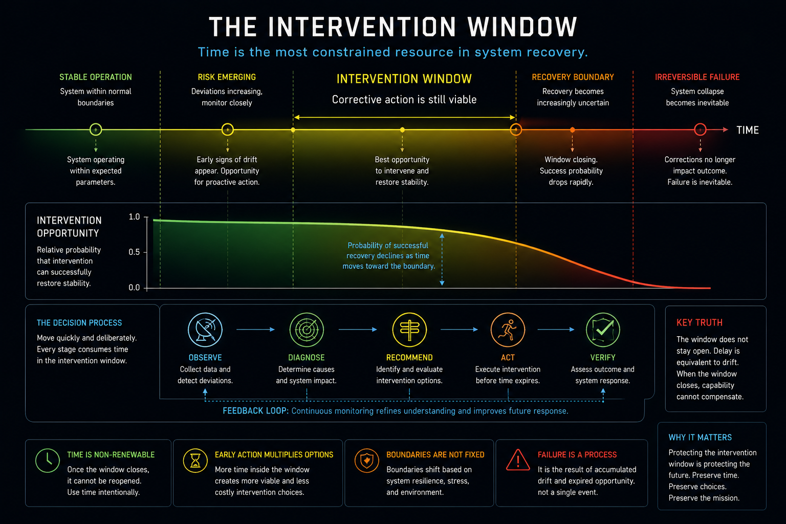
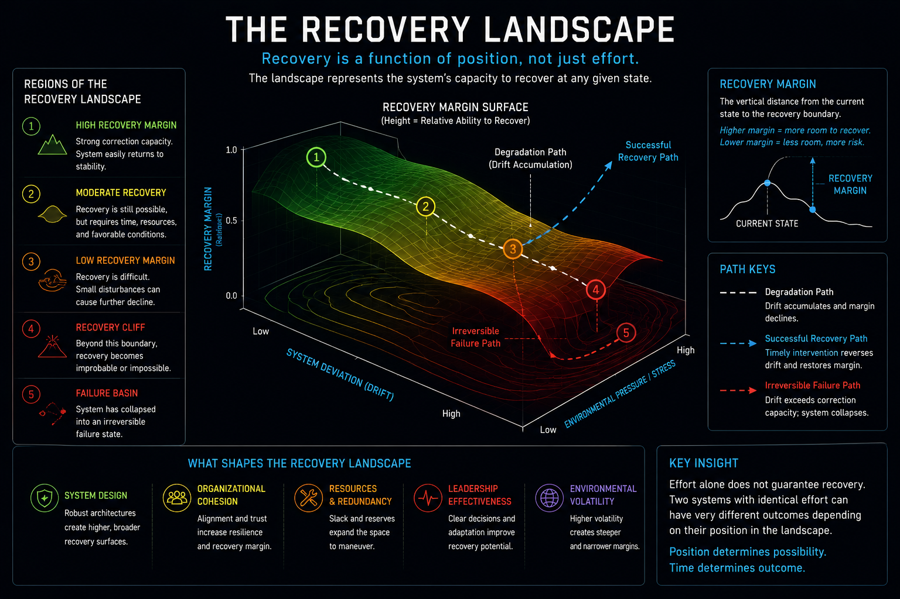
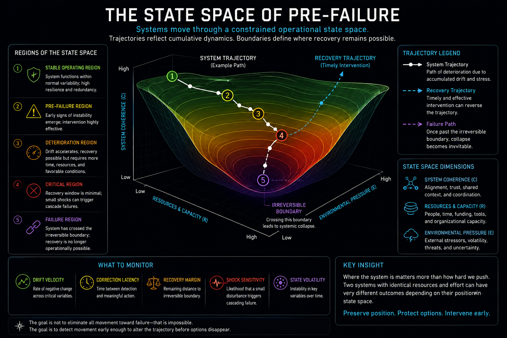
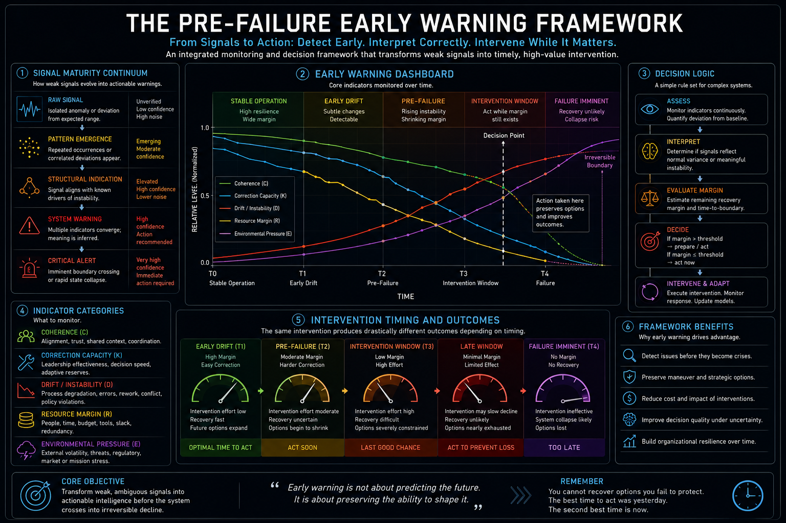

# Pre-Failure Systems

## Figure 1. Modeling Drift Before Failure Becomes Visible


**Figure 1.** Conceptual overview of the Pre-Failure Systems framework. Rather than treating failure as a discrete event, the model represents failure as the cumulative result of increasing drift, declining correction capacity, shrinking intervention opportunities, and diminishing recovery margins. The visualization illustrates the progression from stable operation through drift accumulation, intervention, recovery boundaries, and ultimately irreversible failure, while highlighting the decision variables and feedback mechanisms required to preserve operational stability.

### Key Insight

Failure is rarely sudden. It emerges from measurable changes in system behavior long before breakdown becomes visible. By identifying pre-failure conditions, organizations gain the opportunity to intervene while meaningful recovery remains possible.

## Figure 2. Drift vs. Correction Capacity


**Figure 2.** Drift accumulates while correction capacity declines. The system remains stable until drift exceeds the available capacity to correct deviations. The point where the curves intersect marks the stability threshold, after which intervention becomes increasingly difficult and operational failure becomes progressively more likely.

### Key Insight

System stability depends on the balance between accumulating drift and available correction capacity. Failure begins not when drift appears, but when correction capacity can no longer keep pace with it.

## Figure 3. The Intervention Window



**Figure 3.** This visualization illustrates how the opportunity for successful intervention contracts as system instability accumulates. Rather than treating failure as a discrete event, the model emphasizes that recovery depends on acting before correction capacity falls below operational demand. The figure highlights the relationship between drift accumulation, shrinking intervention windows, recovery boundaries, and irreversible failure, demonstrating that preserving time for corrective action is often more valuable than maximizing corrective force.

### Key Insight

The effectiveness of intervention is determined more by timing than by effort. As instability accumulates, the operational window for successful correction contracts until intervention becomes irrelevant regardless of available resources.

## Figure 4. The Recovery Landscape



**Figure 4.** This visualization illustrates that recovery is a function of system position rather than effort alone. As instability, environmental pressure, and accumulated drift increase, the recovery landscape shifts from broad, stable regions toward increasingly constrained recovery margins and eventual failure basins. The model emphasizes that intervention success depends on preserving favorable system states before recovery becomes operationally impossible.

### Key Insight

Recovery is not determined solely by the quality of an intervention. It depends on whether the system remains within a region of the state space where intervention can still propagate. As recovery margins shrink, identical corrective actions produce progressively smaller effects until recovery is no longer achievable.

## Figure 5. The State Space of Pre-Failure



**Figure 5.** This visualization represents organizational behavior as movement through a constrained operational state space. Rather than viewing failure as a single event, the model treats deterioration as a trajectory through regions of decreasing resilience and increasing constraint. Recovery depends on maintaining sufficient maneuver within the state space before irreversible boundaries are crossed. The figure illustrates how drift, resource depletion, environmental pressure, and declining coherence reshape the set of states that remain operationally reachable.

### Key Insight

Failure is not determined by where a system starts, but by the trajectory it follows through its operational state space. Preserving maneuver means keeping the system within regions where meaningful recovery remains reachable.

## Figure 6. The Pre-Failure Early Warning Framework



**Figure 6.** This visualization integrates the complete pre-failure decision process into a single operational framework. It demonstrates how weak signals mature into actionable warnings, how multiple system indicators should be monitored simultaneously, and how decision-makers can translate early observations into timely intervention. The framework emphasizes that the value of early warning lies not in predicting failure, but in preserving the opportunity to change the system's trajectory before recovery options disappear.

### Key Insight

Early warning systems should not optimize prediction alone. Their primary purpose is to preserve decision quality by identifying instability while meaningful intervention remains operationally achievable.

# Core Principle

Pre-Failure Systems investigates the conditions that emerge before visible failure.

Rather than asking why systems collapse after the fact, this research asks why intervention opportunities disappear while recovery is still theoretically possible.

The objective is to identify measurable indicators of instability early enough to preserve maneuver, support informed decision making, and enable intervention before failure becomes irreversible.

Failure is not an event.

It is the point where accumulated drift exceeds the system's remaining capacity to recover.

--------------------------------

Pre-Failure Systems is a research initiative focused on understanding how complex systems deteriorate before failure becomes operationally visible.

Rather than detecting failure after it occurs, this project investigates measurable indicators that emerge earlier, including drift accumulation, declining correction capacity, shrinking intervention windows, and approaching recovery boundaries.

The objective is to support earlier intervention, improve operational resilience, and provide decision-makers with actionable insight before instability becomes irreversible.

# Research Focus

This repository explores:

- Drift accumulation
- System stability
- Intervention timing
- Recovery boundary estimation
- Correction capacity
- Decision support under uncertainty
- Pre-failure detection
- Operational resilience
- Human-AI decision support

# Repository Contents

```
docs/
    pre-failure-systems-overview.png

models/
    Candidate mathematical models

examples/
    Example operational scenarios

papers/
    Research notes and white papers

notebooks/
    Experiments and simulations
```

# Core Research Questions

- Can system failure be detected before degradation becomes visible?
- Which variables provide the earliest indication of instability?
- How can intervention opportunity be estimated quantitatively?
- How should recovery boundaries be represented?
- What conditions make failure operationally irreversible?

# Long-Term Goal

Develop mathematical and computational methods that estimate:

- System health
- Drift velocity
- Recovery margin
- Intervention opportunity
- Failure probability

before irreversible failure occurs.

# Applications

Potential applications include:

- AI assurance
- Autonomous systems
- Military command and control
- Critical infrastructure
- Industrial operations
- Cybersecurity
- Predictive maintenance
- Enterprise risk monitoring

# Author

**Caroline Suzanne Brooks**

AI Systems Engineer | AI Assurance | Decision Support | Operational Resilience

GitHub: https://github.com/csb1105

LinkedIn: https://linkedin.com/in/csb1105

Website: https://www.carolinebrooks.org

## Principle

> **Failure is not an event. It is the point where accumulated drift becomes irreversible.**
