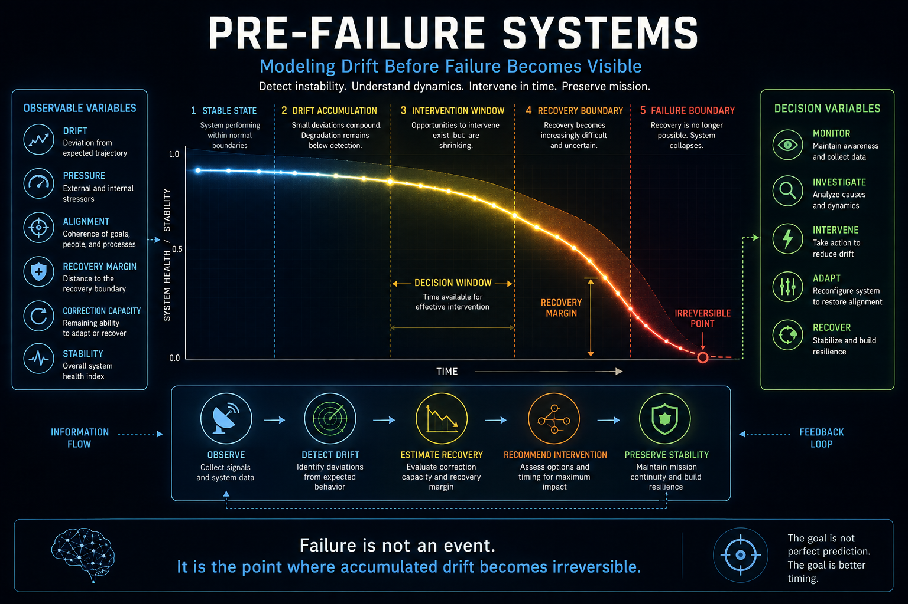
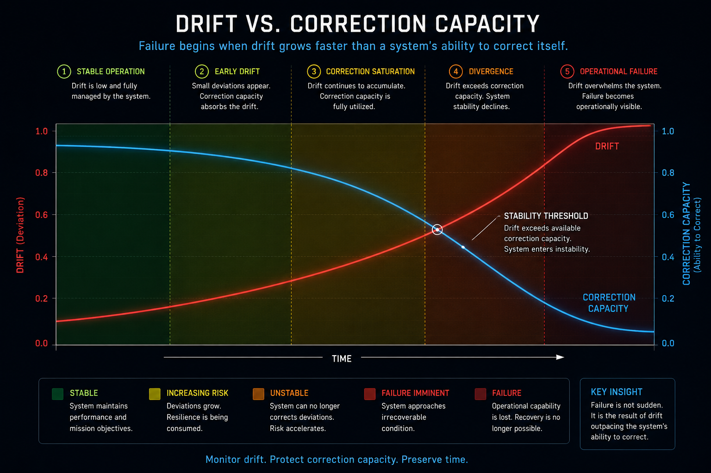

# Pre-Failure Systems

## Modeling Drift Before Failure Becomes Visible



**Figure 1.** Conceptual overview of the Pre-Failure Systems framework. Rather than treating failure as a discrete event, the model represents failure as the cumulative result of increasing drift, declining correction capacity, shrinking intervention opportunities, and diminishing recovery margins. The visualization illustrates the progression from stable operation through drift accumulation, intervention, recovery boundaries, and ultimately irreversible failure, while highlighting the decision variables and feedback mechanisms required to preserve operational stability.

## Drift vs. Correction Capacity



**Figure 2.** Drift accumulates while correction capacity declines. The system remains stable until drift exceeds the available capacity to correct deviations. The point where the curves intersect marks the stability threshold, after which intervention becomes increasingly difficult and operational failure becomes progressively more likely.

Pre-Failure Systems is a research initiative focused on understanding how complex systems deteriorate before failure becomes operationally visible.

Rather than detecting failure after it occurs, this project investigates measurable indicators that emerge earlier, including drift accumulation, declining correction capacity, shrinking intervention windows, and approaching recovery boundaries.

The objective is to support earlier intervention, improve operational resilience, and provide decision-makers with actionable insight before instability becomes irreversible.

# Research Focus

This repository explores:

- Drift accumulation
- System stability
- Intervention timing
- Recovery boundary estimation
- Correction capacity
- Decision support under uncertainty
- Pre-failure detection
- Operational resilience
- Human-AI decision support

# Repository Contents

```
docs/
    pre-failure-systems-overview.png

models/
    Candidate mathematical models

examples/
    Example operational scenarios

papers/
    Research notes and white papers

notebooks/
    Experiments and simulations
```

# Core Research Questions

- Can system failure be detected before degradation becomes visible?
- Which variables provide the earliest indication of instability?
- How can intervention opportunity be estimated quantitatively?
- How should recovery boundaries be represented?
- What conditions make failure operationally irreversible?

# Long-Term Goal

Develop mathematical and computational methods that estimate:

- System health
- Drift velocity
- Recovery margin
- Intervention opportunity
- Failure probability

before irreversible failure occurs.

# Applications

Potential applications include:

- AI assurance
- Autonomous systems
- Military command and control
- Critical infrastructure
- Industrial operations
- Cybersecurity
- Predictive maintenance
- Enterprise risk monitoring

# Author

**Caroline Suzanne Brooks**

AI Systems Engineer | AI Assurance | Decision Support | Operational Resilience

GitHub: https://github.com/csb1105

LinkedIn: https://linkedin.com/in/csb1105

Website: https://www.carolinebrooks.org

## Principle

> **Failure is not an event. It is the point where accumulated drift becomes irreversible.**
